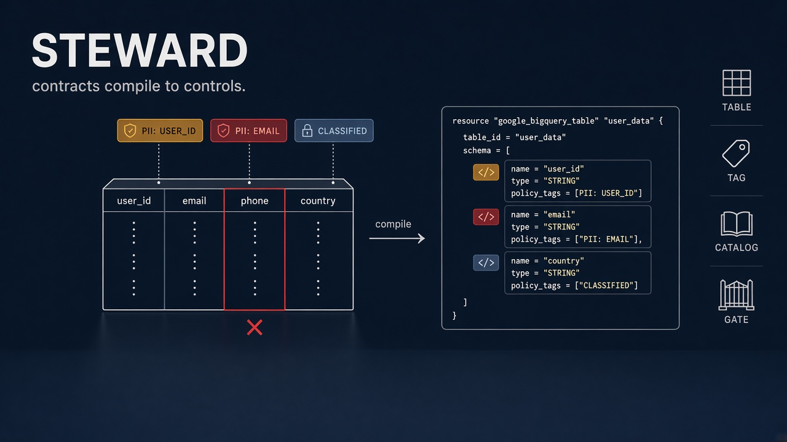
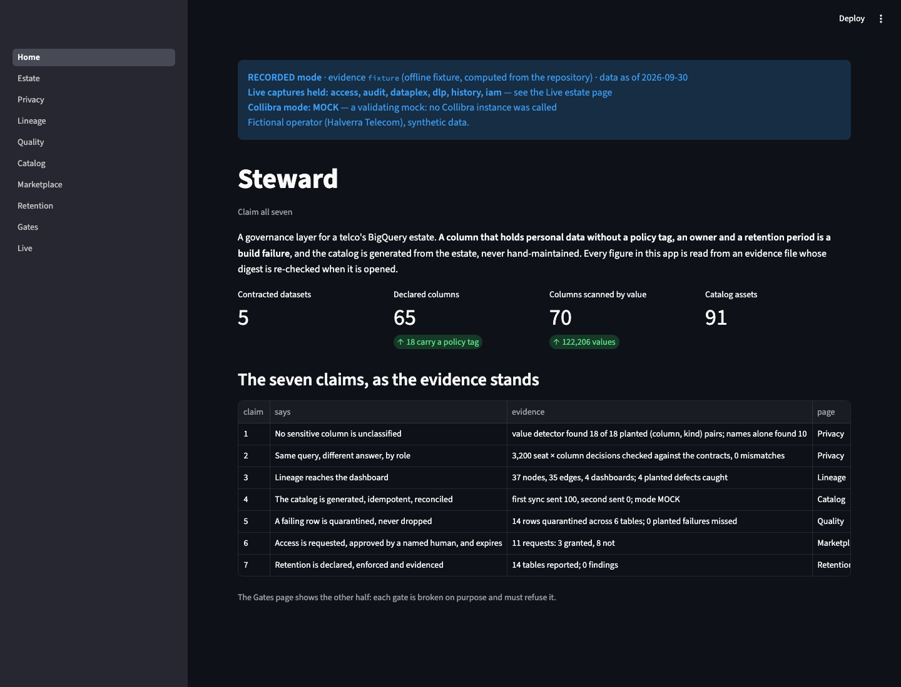
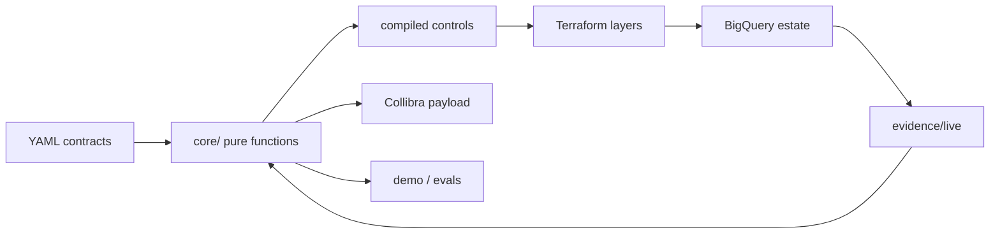
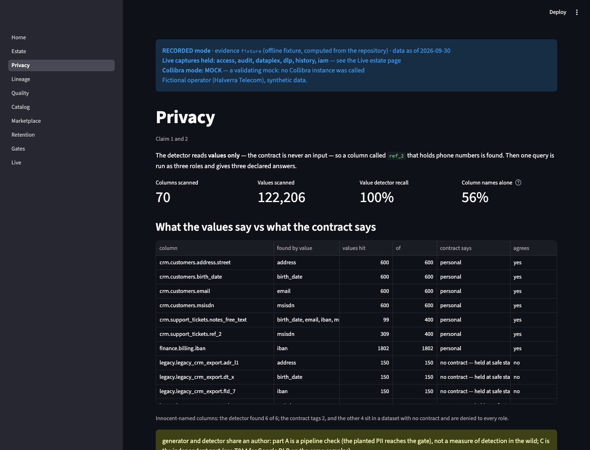
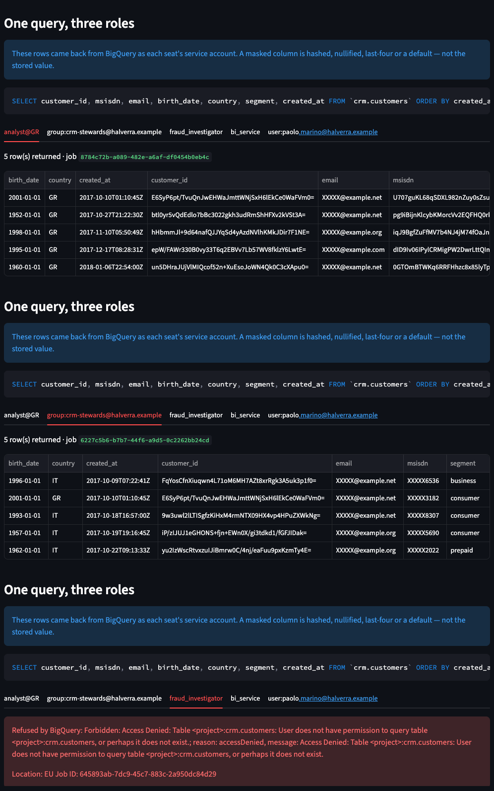
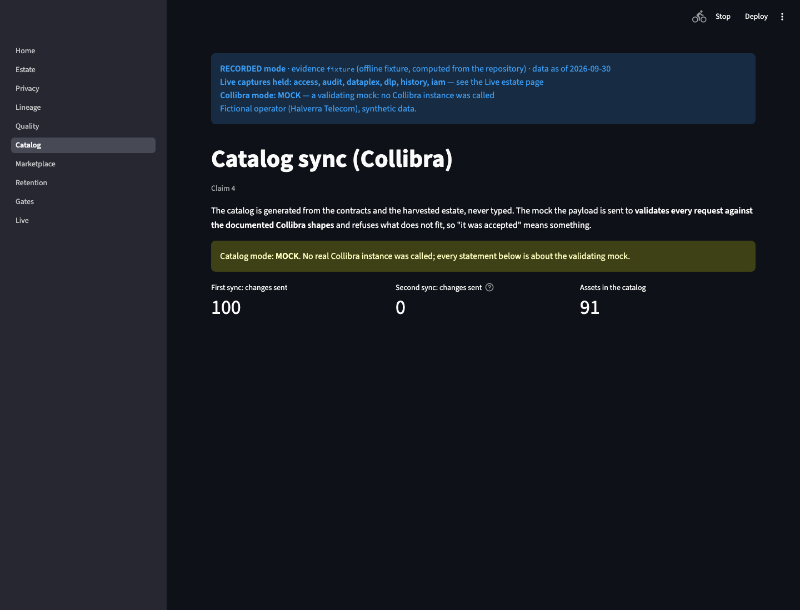
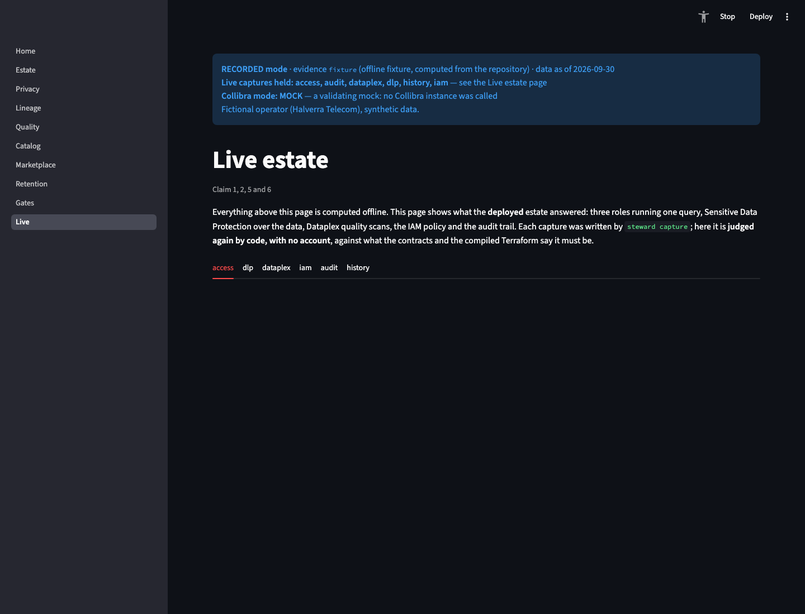

> **Catalog mode: MOCK** (no Collibra instance has accepted these calls). **The operator, Halverra
> Telecom, is fictional; every row of data is synthetic.**

<p align="center">
  <br>
  <sub><b>Contracts compile to controls.</b> — an untagged phone column is a build failure, not a catalog entry.</sub>
</p>

# Steward

<p align="center">
  <a href="https://github.com/theofanis-tsakanikas/steward/actions/workflows/ci.yml"></a>
  <a href="LICENSE"></a>
  
  
  <br>
  
  
  
  
  <br>
  
  
  
</p>

**A column that holds personal data without a policy tag, an owner and a retention period is a build failure — and the catalog is generated from the estate, never hand-maintained.**
*Python · BigQuery · Terraform · Streamlit · a validating Collibra mock*

---

## The problem

A telco's data lands in a warehouse: customers, contracts, usage, network events, billing. Analysts query it, dashboards are built on it, and a business catalog is meant to describe it. The three drift apart within a month: a new column holds a phone number and nobody tagged it; a dashboard reads a table nobody knows exists; the catalog says a dataset is owned by someone who left.

Steward makes the estate declare itself and makes that drift a failing build. Five contracted datasets, 70 columns scanned by value (122,206 values), 18 of 18 planted (column, kind) pairs found by the detector — names alone found 10, and name-heuristics are never counted as proof.

## Status

Applied on GCP on 2026-10-02, captured, judged offline, then destroyed. The GitHub `destroy` workflow is green (`ok sweep: 0` leftovers). The bootstrap layer (state bucket, Workload Identity, budget, guard, reaper) remains until the project is deleted — it is not $0 idle. The repository is public. **Demo (no login):** [https://steward-governance.streamlit.app](https://steward-governance.streamlit.app) — live captures first, fixture only where none exists.

<p align="center">
  <br>
  <sub><b>Seven claims, each figure labelled.</b> — Collibra MOCK, fictional operator. Live transcripts, DLP, Dataplex, IAM; fixture for catalog, retention, gates.</sub>
</p>

## Contents

- [The problem](#the-problem) · [Status](#status)
- [Architecture](#architecture)
- [No sensitive column is unclassified](#no-sensitive-column-is-unclassified) · [Same query, three answers](#same-query-three-answers)
- [The catalog is generated](#the-catalog-is-generated) · [Live captures, judged offline](#live-captures-judged-offline)
- [Quickstart](#quickstart) · [Testing](#testing) · [Repository layout](#repository-layout)
- [What this does not do](#what-this-does-not-do) · [Cost](#cost) · [Decisions](#decisions)
- [Docs](#docs) · [Security](#security) · [License](#license)

---

## Architecture



Contracts are the only source of truth. `core/` decides; adapters talk to GCP, Looker and Collibra; the Collibra catalog is generated and reconciled. A model may draft a description; it may never classify, grant, or approve.

---

## No sensitive column is unclassified

The detector reads **values only**. The contract is never an input. A column called `ref_2` that holds phone numbers is found; a detector that read the contract would be one function agreeing with itself.



<sub><b>Values vs the contract.</b> — `crm.support_tickets.ref_2` is an MSISDN; the contract tags it personal. Innocent-named columns: 6 of 6 found.</sub>

Live, Google DLP on the same planted set was 16/18 (misses listed in `evals/dlp`: `crm.customers.address.street` / address, `legacy.legacy_crm_export.dt_x` / birth_date). The core detector stayed 18/18. n = 18 (column, kind). The screenshot above is the offline detector; DLP is the next block on that page.

## Same query, three answers

Contracts compile to policy tags, masking (hash, nullify, last-four) and row access policies. Offline proves the compiled Terraform is what the contract implies — 3,200 seat × column decisions, 0 mismatches. Enforcement was captured live as three role transcripts (analyst / fraud / steward) and is re-checked by `scripts/check_live.py` with no account.



<sub><b>One query, three answers, from the estate.</b> — same <code>SELECT</code> on <code>crm.customers</code>. Analyst: hashed MSISDN, <code>XXXXX@example.net</code>, GR rows only. Steward: last-four MSISDN, IT and GR. Fraud: Access Denied. Live capture 2026-10-02, then destroyed.</sub>

## The catalog is generated

The Collibra payload (communities, domains, assets, relations, responsibilities) is built from contracts + harvest. The validating mock rejects unknown asset types, missing attributes and dangling relations. First sync sent 100 changes; second sent 0. Mode **MOCK**.



<sub><b>Generated, idempotent, mocked.</b> — the yellow banner is the point: no Collibra instance was called.</sub>

## Live captures, judged offline

The estate answered; the repository judges. Six live files (`access`, `dlp`, `dataplex`, `iam`, `audit`, `history`) sit beside the fixtures. Claim pages show a live capture first when one exists; this page re-judges every file with no GCP account.



<sub><b>Live, re-judged offline.</b> — six capture tabs; every check passes in CI (`check_live.py`), not only on this page.</sub>

---

## Quickstart

Requires Python 3.12 and [`uv`](https://docs.astral.sh/uv/). No GCP account.

```bash
# 1. install
uv sync --all-extras --group dev

# 2. the offline suite (lint, tests, evals, gates, terraform validate)
make preflight

# 3. the recorded demo
uv run --extra demo streamlit run app/Home.py
```

Open http://localhost:8501, or the hosted app: [https://steward-governance.streamlit.app](https://steward-governance.streamlit.app). Every figure is read from `evidence/fixture/` or `evidence/live/` and re-checked by digest when the page opens.

## Testing

**358 tests** — contracts, compilers, lineage, catalog mock, quality, marketplace, retention, live judges, the sweep, the ids gate. They do not call GCP. Live captures are re-judged from committed JSON.

```bash
make test         # pytest
make lint         # ruff
make evals        # one harness per claim
make check        # every structural gate, including check_ids.py
make gate-proof   # 122 mutations; the named gate must refuse each one
```

CI ([`.github/workflows/ci.yml`](.github/workflows/ci.yml)) is offline by construction: no cloud credentials. Deploy and destroy are `workflow_dispatch` only, on `main`, in named environments.

## Repository layout

| Path | Purpose |
|---|---|
| [`contracts/`](contracts/) | One YAML per dataset: owners, columns, retention, DQ, access |
| [`src/steward/core/`](src/steward/core/) | Pure functions — no `google.cloud`, no Streamlit |
| [`src/steward/adapters/`](src/steward/adapters/) | Thin GCP / Looker / Collibra clients |
| [`app/`](app/) | Streamlit demo, recorded mode default |
| [`evals/`](evals/) | One directory per claim |
| [`evidence/`](evidence/) | Fixture + live captures, with digests |
| [`infra/`](infra/) | Terraform: bootstrap · estate · governance · assurance · marketplace |
| [`scripts/`](scripts/) | Gates, sweep, generate, capture |
| [`docs/`](docs/) | Decisions, ADRs, scenario, regulatory posture |

## What this does not do

- **Collibra was never called.** The adapter has a real REST client; the evidence and the demo say MOCK. A trial was requested and has not arrived (deferred, expiry 2026-11-03).
- **Looker was parsed, not subscribed.** Lineage from LookML is cross-checked against independent query history. There is no Looker trial.
- **BigQuery deletion is not immediate.** Time travel and fail-safe keep data recoverable for up to about 14 days; the retention report's first line says so.
- **The live estate is gone.** Screenshots and `evidence/live/` are what remain. Bootstrap is still in the project until it is deleted.
- **Nothing approves itself.** No pipeline, model or service account grants access, lowers a classification, or accepts its own drafted description.
- **T031 (model-proposed descriptions) is cut.** Unlock: T030 closed with time left.

## Cost

The estate is gone (no BigQuery datasets). Bootstrap stands until the project is deleted — not $0 idle. Expected live spend was about €1–3 with a guard at €45 (`docs/GCP-CONSTRAINTS.md`). DAY-ONE step 4 (budget emails arrived) is still open, so silence at €30/€50 is not evidence the alarm works. Target for the whole exercise was ≤ €50.

## Decisions

Eight ADRs in [`docs/adr/`](docs/adr/) — the doctrine — and the running ledger in [`docs/DECISIONS.md`](docs/DECISIONS.md).

| | |
|---|---|
| [0001](docs/adr/0001-safe-state-is-sensitive-and-deny.md) | Unknown sensitivity is treated as sensitive and denied |
| [0003](docs/adr/0003-a-default-is-never-invented.md) | A missing owner or retention is a failing build, not a default |
| [0005](docs/adr/0005-nothing-approves-itself.md) | No pipeline or service account grants or classifies |
| [0007](docs/adr/0007-the-door-with-no-key.md) | A column in which personal data was found cannot be declared non-sensitive |
| [0008](docs/adr/0008-layers.md) | Bootstrap local; every other layer from CI; no long-lived keys |

Rejected: Cloud Composer as a standing resource; a JS front end; treating the catalog as a safety control (privacy fails closed; documentation fails open, loudly).

## Docs

[SCENARIO](docs/SCENARIO.md) · [DECISIONS](docs/DECISIONS.md) · [INTERVIEW](docs/INTERVIEW.md) · [REGULATORY](docs/REGULATORY.md) · [GCP-CONSTRAINTS](docs/GCP-CONSTRAINTS.md) · [DAY-ONE](docs/DAY-ONE.md) · [COLLIBRA](docs/COLLIBRA.md) · [CHANGELOG](CHANGELOG.md)

Engineering rules: [`CLAUDE.md`](CLAUDE.md). How to run a clone: [`CONTRIBUTING.md`](CONTRIBUTING.md).

## Security

Scope, reporting, and the ids gate: [SECURITY.md](SECURITY.md).

## License

[MIT](LICENSE) © 2026 Theofanis Tsakanikas
